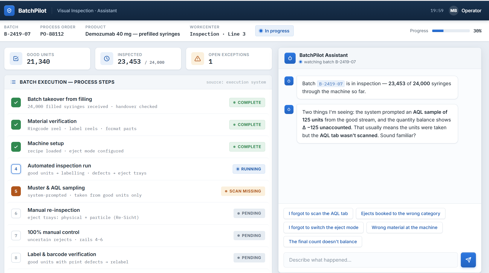
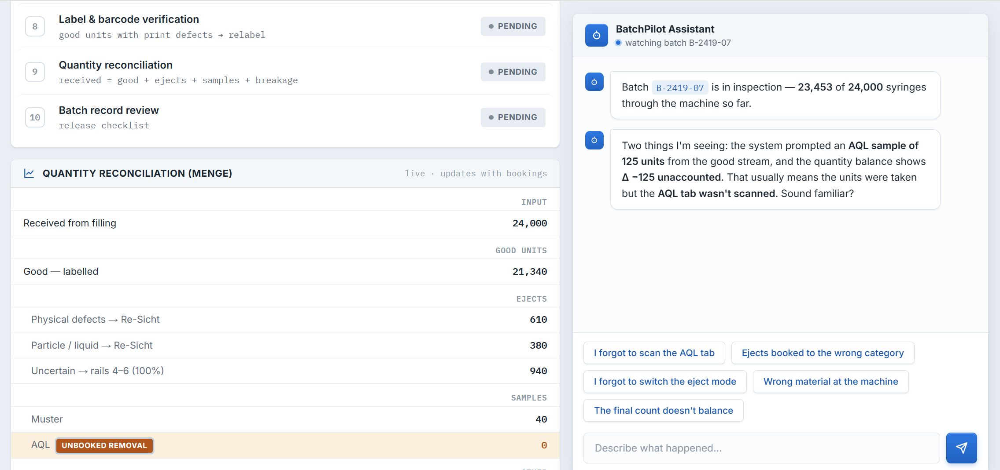
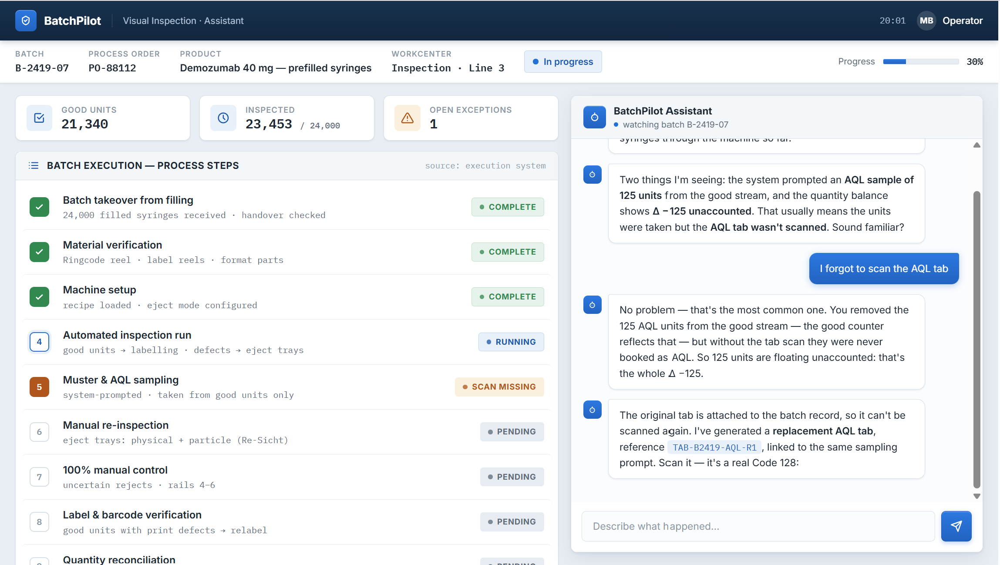
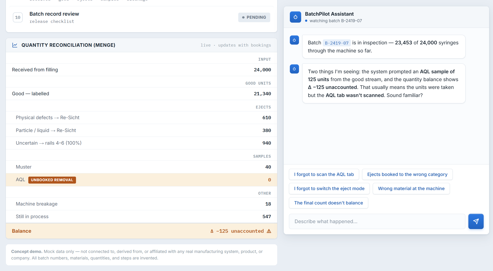

# 💊 PharmaPilot AI

> An AI copilot for pharmaceutical visual inspection (Sichtkontrolle) — guiding batch workflows, reconciling quantities, and explaining discrepancies in plain language.


---

## Overview

Visual inspection is one of the most demanding steps in sterile pharmaceutical production. Operators work under time pressure, every unit must be accounted for, and a single unbooked AQL sample can turn into a deviation and hours of investigation.

**PharmaPilot AI** is a prototype of a digital assistant for exactly this environment. It walks through a batch from receipt to release checklist, keeps a **live quantity reconciliation (Menge)** running in the background, and when the numbers don't balance, the built-in AI copilot explains *why* — before it becomes a deviation.

> Designed by a software engineer who went into GMP production deliberately — to study these workflows where they actually happen, and to build software that solves real problems, not imagined ones. Every scenario in this demo — the forgotten AQL scan, the eject booked to the wrong category, the count that doesn't balance at shift end — comes from direct process observation on the production floor.

## 🖼️ Screenshots

### Dashboard Overview


### Batch Details & Process Steps


### AI Copilot Chat


### Deviation Investigation


<!-- keep your existing screenshots section as it is -->

**[▶️ Live Demo](https://mahbejam.github.io/pharmaPilot-AI/)**

## ✨ Key Features

### Guided batch workflow
A step-by-step checklist covering the full inspection lifecycle — batch takeover from filling, material verification, machine setup, automated inspection run, Muster & AQL sampling, manual re-inspection, 100% manual control, label & barcode verification, quantity reconciliation, and batch record review — with live status tracking.

### Live quantity reconciliation (Menge)
The core formula of every inspection batch, always visible and always up to date:

```
received = good + ejects + samples + breakage
```

The panel tracks input units, good/labelled units, eject categories (physical defects → Re-Sicht, particle/liquid → Re-Sicht, uncertain → rails), AQL and Muster samples — and flags **unbooked removals** the moment a delta appears.

### AI copilot with realistic production scenarios
A conversational assistant that understands the context of the running batch. Example from the demo:

> *"The system prompted an AQL sample of 125 units from the good stream, and the quantity balance shows Δ −125 unaccounted. That usually means the units were taken but the AQL tab wasn't scanned. Sound familiar?"*

Built-in quick diagnoses for the most common real-world discrepancies:
- I forgot to scan the AQL tab
- Ejects booked to the wrong category
- I forgot to switch the eject mode
- Wrong material at the machine
- The final count doesn't balance

### Batch record review
A release checklist that mirrors how batch records are reviewed before release — designed with GMP documentation principles (ALCOA+) in mind.

## 🛠️ Tech Stack

- **Frontend:** Single-file HTML / CSS / JavaScript — zero dependencies, runs anywhere
- **Design:** Industrial MES-inspired UI, optimized for shop-floor readability
- **Data:** Mock batch data for demonstration purposes

## 🚀 Getting Started

```bash
git clone https://github.com/mahbejam/pharmaPilot-AI.git
cd pharmaPilot-AI
# open index.html in your browser — no build step, no install
```

## 📌 Project Status & Roadmap

This is an MVP demonstrating the core concept. Planned next steps:

- Connect the chat to a real LLM
- Rules engine for automatic state detection
- Expanded exception library
- Persistent batch history (localStorage → small backend)
- Shift handover summary generated by the AI copilot
- Deviation pre-report drafting from reconciliation deltas
- German / English interface toggle

## ⚠️ Disclaimer

PharmaPilot AI is a **frontend prototype using mock data only**. It is not affiliated with any real manufacturing system, product, or company. All batch numbers, materials, quantities, and process steps are invented. Built for demonstration and portfolio purposes.

## 👩‍💻 Author

**Mahbube Bejam**
Software Developer (B.Sc. Software Engineering) — building AI-assisted
tools for pharma and healthcare digitalization.

This project is based on deep first-hand insight into GMP production
processes — I went into the industry to study these workflows where
they actually happen, in order to design software that solves real
problems, not imagined ones.

- GitHub: [@mahbejam](https://github.com/mahbejam)

⭐ If you find this project useful, consider giving it a star.

## 📄 License

MIT — free to use, modify, and build on.
